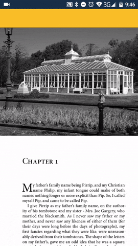

# PDFView-Android Xamarin Binding

A binding library for https://github.com/Dmitry-Borodin/pdfview-android

[]() []()

Available on NuGet: [](https://www.nuget.org/packages/Xamarin.Bindings.PDFView-Android/)

## Preview

[]()

## Installing

Add [NuGet package](https://www.nuget.org/packages/Xamarin.Bindings.PDFView-Android) to your Xamarin.Android project

```
PM> Install-Package Xamarin.Bindings.PDFView-Android
```

## Setup and Usage

* Add to your layout file
```xml
<com.pdfview.PDFView
    android:id="@+id/pdf_view"
    android:layout_width="match_parent"
    android:layout_height="match_parent" />
```

* Load bundled file:
```csharp
FindViewById<PDFView>(Resource.Id.pdf_view)
    .FromAsset("asset_file.pdf")
    .Show();
```

* To open pdf from the Internet, first download it to a temporary folder and then use `PDFView.FromPath(string).Show()`:
```csharp
FindViewById<PDFView>(Resource.Id.pdf_view)
    .FromPath("path-to-temp-folder/fileName.pdf")
    .Show();
```

PDFView is inherited from a slightly modified [SubsamplingScaleImageView](https://github.com/davemorrissey/subsampling-scale-image-view) - a beautiful library which provides different configuration options such as scaling, zooming, custom animations and more.

For details please visit Subsampling Scale Image View [wiki page](https://github.com/davemorrissey/subsampling-scale-image-view/wiki).

## Apk size impact

* Projects which already use Kotlin-Stdlib: ~120 Kb
* Projects without Kotlin-StdLib: ~550 Kb

This library doesn't reference [Xamarin.Kotlin.StdLib](https://www.nuget.org/packages/Xamarin.Kotlin.StdLib) because it doesn't need kotlin-stdlib **binding itself**, it uses only java classes from it.
Including C# binding classes shipped with Xamarin.Kotlin.StdLib would require ~1.5 Mb of apk size without a reason.

That's why this library also embeds kotlin-stdlib jar. 

Resolution of a java class duplication conflict is provided by a special build target. If your project already uses kotlin-stdlib jar then our version will be excluded from compilation.

## Try this library in action!

Build and deploy [PDFView-Android.Sample](PDFView-Android.Sample) project to your android device/emulator.

## Copyright

* **Vadim Sedov** - *Binding library & sample* - [SIDOVSKY](https://github.com/SIDOVSKY)
* **Dmitry Borodin** - *"pdfview" java library* - [Dmitry-Borodin](https://github.com/Dmitry-Borodin)
* **David Morrissey** - *Subsampling Scale Image View library* - [davemorrissey](https://github.com/davemorrissey)

See the [NOTICE](NOTICE) file for details.

## License

This project is licensed under the Apache License, Version 2.0 - see the [LICENSE](LICENSE) file for details.